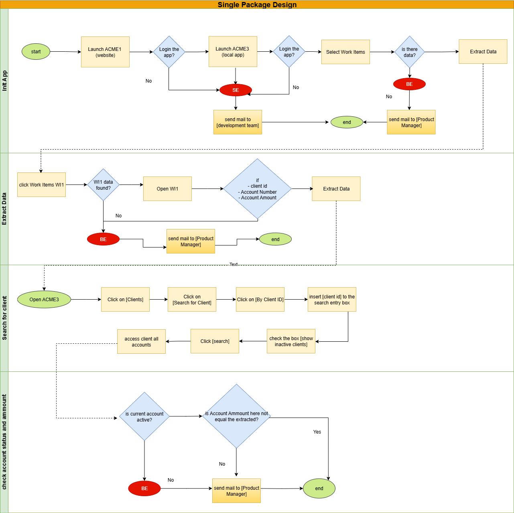
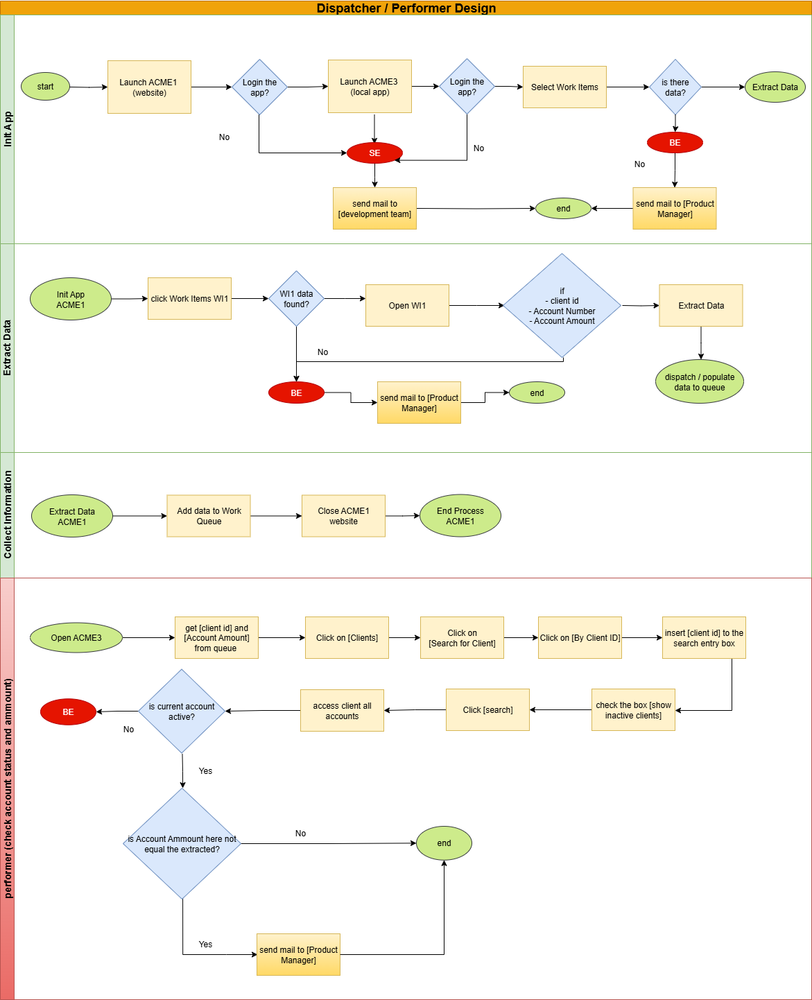

# Detecting un updated Account Amount for WI1

- Open Work Items in ACME.
- For each WI1 (Verify Account Position) item that is Open:
  - Extract the following from the details page: **Client ID**, **Account Number**, **Account Amount**.
  - Go to the Clients → Client by ID page:
    - Enter the Client ID in the search form.
    - Check the box **Include inactive clients**.
    - Hit **Search**.
    - Double-click the displayed client record.
    - Open the **Client Accounts** section.
  - Compare the extracted details:
    - If the account number status = **Active**:
      - Compare the Account Amount with ACME WI1.
      - If different, update the amount.
    - If the account number status = **Suspended**:
      - Check other accounts for this client ID.
      - If there are active accounts, send an email to **manager.co.dev** including:
        - **Client ID**
        - **Current account number** and **status**
        - The active accounts and their amounts.
      - If all accounts are suspended, send an email to **manager.co.dev** with:
        - **Client ID**
        - A message that all accounts for this client are suspended and the client can be cancelled.

## Designs for the SDD Solutions for the process

### Single Package Design

### Dispatcher / Performer Design

