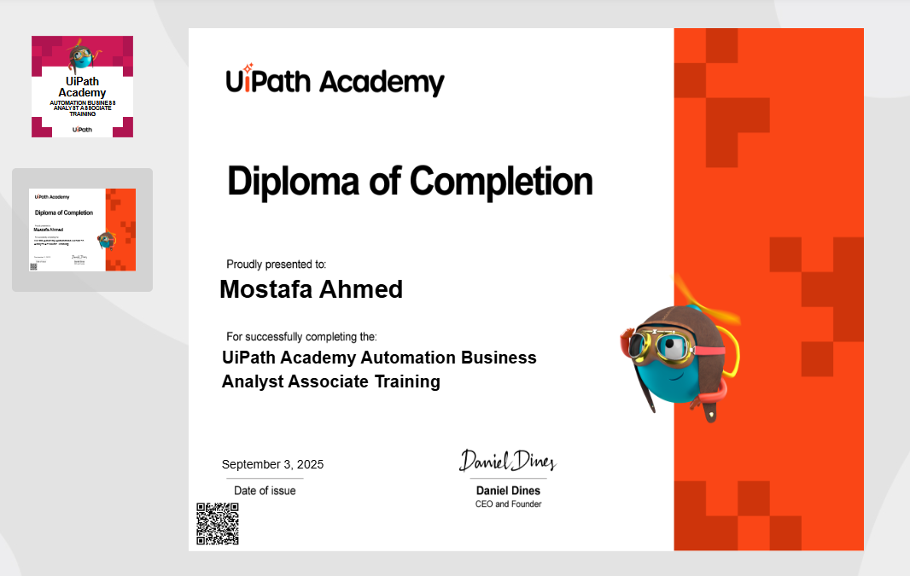
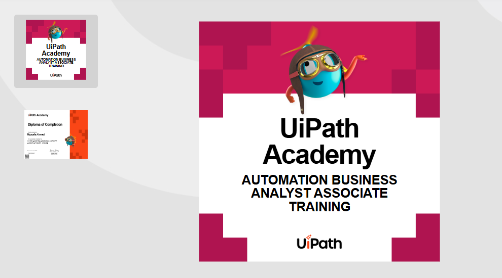

# My RPA Business Analyst Certification

 

## 📄 Certificate of Completion

I am proud to announce that I have successfully completed the **RPA Business Analyst** certification. This achievement validates my skills and knowledge in identifying, analyzing, and documenting business processes for automation.

---

### **Key Skills Acquired:**

- **Process Analysis:** Proficient in mapping "As-Is" and "To-Be" processes.
- **Business Case Development:** Skilled in assessing automation feasibility and ROI.
- **Stakeholder Management:** Able to effectively communicate with business units and technical teams.
- **Documentation:** Expertise in creating comprehensive Process Definition Documents (PDDs).
- **RPA Methodologies:** A deep understanding of the automation implementation lifecycle.

---

### **About the Certification**

This certification demonstrates my ability to act as the crucial link between business needs and technical solutions in the field of Robotic Process Automation (RPA). It confirms my capability to drive successful automation projects from the initial discovery phase through to implementation.

---

### **Certificate Image**

 

 

---

### **Contact**

Feel free to connect with me on LinkedIn to discuss RPA and automation opportunities!
