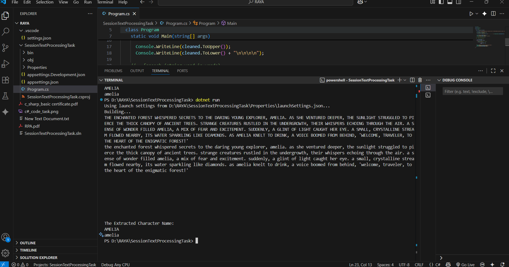

# C# online session task

## Text:

```code
"The ##enchanted## forest whispered secrets to the ##daring## young explorer, Amelia. As she ventured deeper, the sunlight struggled to pierce the thick canopy of ancient trees. Strange ##creatures## rustled in the undergrowth, their ##whispers## echoing through the air. A sense of ##wonder## filled Amelia, a mix of fear and excitement. Suddenly, a glint of light caught her eye. A small, ##crystalline## stream flowed nearby, its water sparkling like diamonds. As Amelia knelt to drink, a voice boomed from behind, 'Welcome, traveler, to the heart of the ##enigmatic## forest!'"

```

## Requirements

1- Remove Hashtags (##): Use Replace to replace "##" with an empty string.
2- Extract Character name: Use Split the string into words using Split().
3- Convert to Uppercase/Lowercase

## Answer Screenshot


