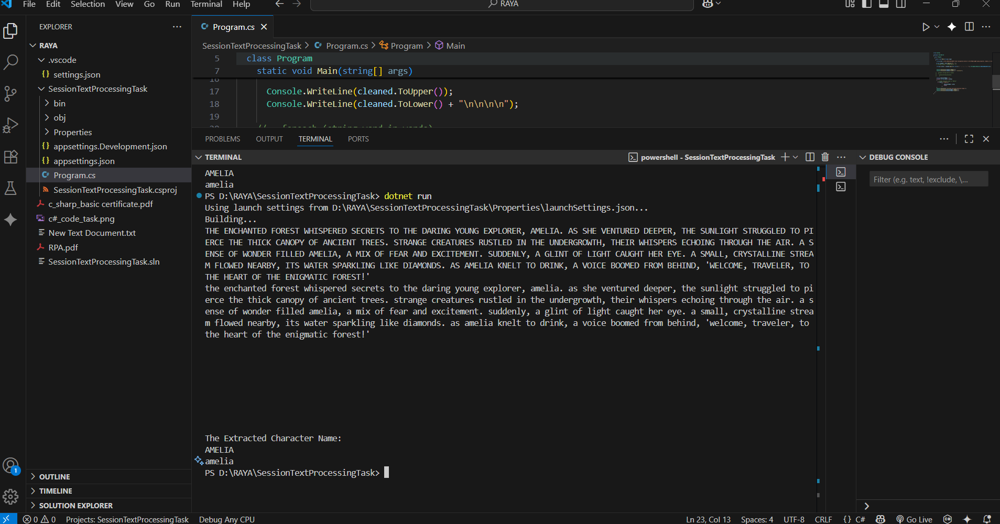

# C# online session task

## Text

```code
"The ##enchanted## forest whispered secrets to the ##daring## young explorer, Amelia. As she ventured deeper, the sunlight struggled to pierce the thick canopy of ancient trees. Strange ##creatures## rustled in the undergrowth, their ##whispers## echoing through the air. A sense of ##wonder## filled Amelia, a mix of fear and excitement. Suddenly, a glint of light caught her eye. A small, ##crystalline## stream flowed nearby, its water sparkling like diamonds. As Amelia knelt to drink, a voice boomed from behind, 'Welcome, traveler, to the heart of the ##enigmatic## forest!'"

```

## Requirements

1. Remove Hashtags (##): Use Replace to replace "##" with an empty string.
2. Extract Character name: Use Split the string into words using Split().
3. Convert to Uppercase/Lowercase.

## Created Logic

```csharp
using System;

namespace HelloWorld
{
  class Program
  {
    static void Main(string[] args)
    {
      string text = @"The ##enchanted## forest whispered secrets to the ##daring## young explorer, Amelia. As she ventured deeper, the sunlight struggled to pierce the thick canopy of ancient trees. Strange ##creatures## rustled in the undergrowth, their ##whispers## echoing through the air. A sense of ##wonder## filled Amelia, a mix of fear and excitement. Suddenly, a glint of light caught her eye. A small, ##crystalline## stream flowed nearby, its water sparkling like diamonds. As Amelia knelt to drink, a voice boomed from behind, 'Welcome, traveler, to the heart of the ##enigmatic## forest!'";
      
     string cleaned = text.Replace("#", "");
     // string[] words = cleaned.Split(" ");
    
      string[] words = cleaned.Split(new char[] { ' ', ',', '.', '!'}, StringSplitOptions.RemoveEmptyEntries);
      
      
      Console.WriteLine(text.ToUpper());
      Console.WriteLine(text.ToLower() + "\n\n\n\n");

      foreach (string word in words)
      {
        Console.WriteLine(word);
        }
     
   string characterName = "";
      foreach (string word in words)
      {
       // assume character name is "Amelia"
        if (word == "Amelia")
                {
                    characterName = word;
                    break;
                }
      }
      Console.WriteLine("\n\n\nThe Extracted Character Name:");
      Console.WriteLine(characterName.ToUpper());
      Console.WriteLine(characterName.ToLower());
    }
  }
}

```

## Answer Screenshot


