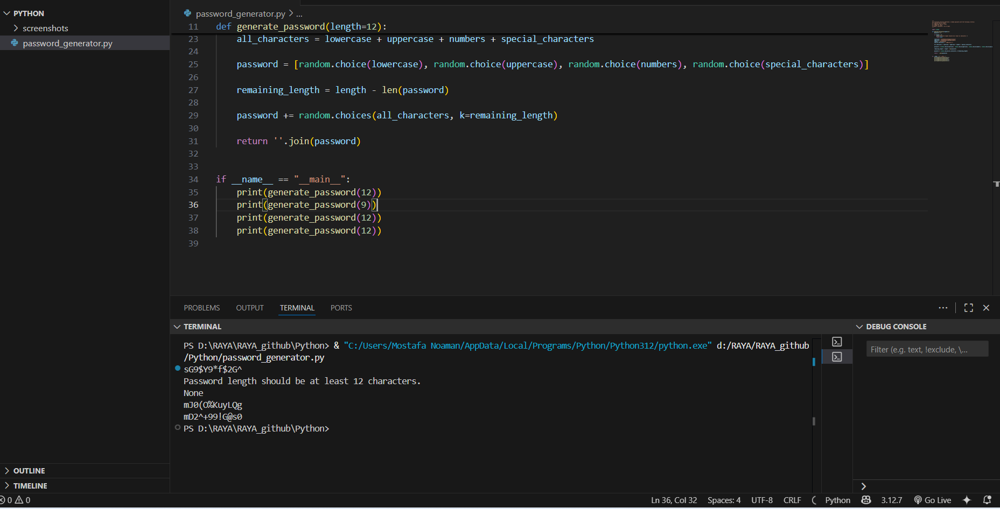

# C# online session task

## Text

The problem statement is to create a logic that generates random password

## Requirements

- The code should be a python function with the following criteria:
  - 1 special char at least
  - 1 uppercase char at least
  - 1 number at least
  - lengh of password = 12 at least

## Created Logic

```python
import random

def generate_password(length=12):
    password = []

    if length < 12:
        print("Password length should be at least 12 characters.")
        return None

    lowercase = "abcdefghijklmnopqrstuvwxyz"
    uppercase = "ABCDEFGHIJKLMNOPQRSTUVWXYZ"
    numbers = "0123456789"
    special_characters = "!@#$%^&*()-+"

    all_characters = lowercase + uppercase + numbers + special_characters

    password = [random.choice(lowercase), random.choice(uppercase), random.choice(numbers), random.choice(special_characters)]

    remaining_length = length - len(password)

    password += random.choices(all_characters, k=remaining_length)

    return ''.join(password)
```

## Answer Screenshot


